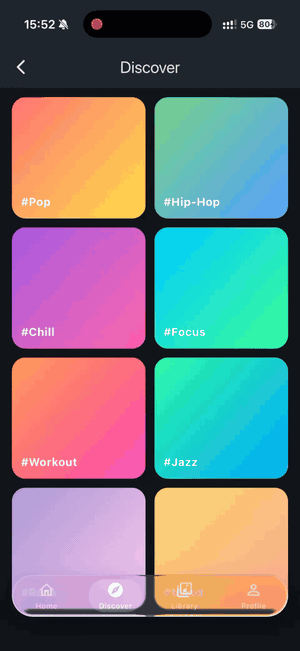
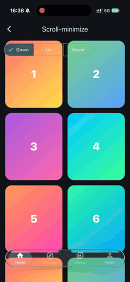
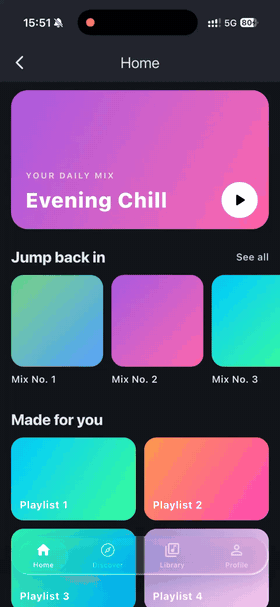
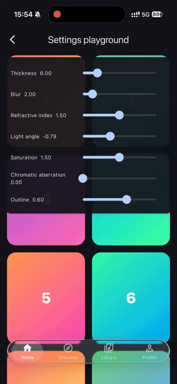

<!-- Demo GIFs live in doc/assets/ (see doc/assets/README.md). -->

<h1 align="center">Liquid Glass Bottom Bar</h1>

<p align="center">
  A drop-in Flutter bottom navigation bar rendered with Apple's iOS 26
  <b>Liquid Glass</b> material — real edge refraction, specular highlights,
  spring-driven motion and scroll-to-minimize, with a universal frosted
  fallback so it works everywhere.
</p>

<p align="center">
  <a href="https://pub.dev/packages/liquid_glass_bottom_nav_bar"></a>
  <a href="https://pub.dev/packages/liquid_glass_bottom_nav_bar/score"></a>
  <a href="LICENSE"></a>
  
</p>

<p align="center">
  
</p>

Most "glass" packages just blur the background. This one draws a hand-rolled
GLSL fragment shader that **bends the backdrop at the bevel** like a real pane
of glass — Snell's-law refraction, a Fresnel rim and adaptive tint, all in a
single pass over the live content behind it. Where shaders aren't available it
degrades honestly to a `BackdropFilter` frost, so the same widget ships on every
target.

> **Zero glass dependencies.** The material is written from scratch; the only
> runtime dependency is [`flutter_shaders`](https://pub.dev/packages/flutter_shaders).

## Features

- 🫧 **Real refraction** — SDF-based edge displacement (Snell's law, IOR ≈ 1.5),
  a Fresnel specular rim, adaptive tint/vibrancy and optional chromatic
  aberration, in one fragment-shader pass over the live backdrop.
- 🪶 **Floating capsule** — inset, concentric, content scrolls underneath.
- 📉 **Scroll-to-minimize** — four behaviors mirroring `tabBarMinimizeBehavior`
  (`automatic`, `never`, `onScrollDown`, `onScrollUp`).
- 💧 **Spring-driven selection** — the pill slides with interruptible,
  velocity-aware physics and a subtle stretch/squash; drag across to scrub.
- 🎵 **Bottom accessory** — a persistent shelf (e.g. a mini-player) that
  collapses from `expanded` to `inline` alongside the bar.
- 🔎 **Search morph** — a search tab that morphs the capsule into a text field.
- ♿ **Accessibility-first** — honors Reduce Motion, Increase Contrast, a
  reduce-transparency flag, text scaling and full `Semantics`.
- 🖥️ **Dual-path rendering** — Impeller shader primary, `BackdropFilter`
  fallback for everything else. Chosen automatically.

## Gallery

| Refraction | Scroll-to-minimize | Spring selection | Settings playground |
|:---:|:---:|:---:|:---:|
|  |  |  |  |

## Install

```yaml
dependencies:
  liquid_glass_bottom_nav_bar: ^0.0.1
```

```sh
flutter pub add liquid_glass_bottom_nav_bar
```

## Usage

Use it like Flutter's `NavigationBar`. Place it in `Scaffold.bottomNavigationBar`
with **`extendBody: true`** so the body scrolls underneath and refracts through
the glass:

```dart
import 'package:flutter/material.dart';
import 'package:liquid_glass_bottom_nav_bar/liquid_glass_bottom_nav_bar.dart';

class HomeShell extends StatefulWidget {
  const HomeShell({super.key});
  @override
  State<HomeShell> createState() => _HomeShellState();
}

class _HomeShellState extends State<HomeShell> {
  int _index = 0;

  @override
  Widget build(BuildContext context) {
    return Scaffold(
      extendBody: true, // ← lets your content show through the glass
      body: const _Page(),
      bottomNavigationBar: LiquidGlassBottomBar(
        selectedIndex: _index,
        onDestinationSelected: (i) => setState(() => _index = i),
        items: const [
          LiquidGlassBarItem(
            icon: Icon(Icons.home_outlined),
            selectedIcon: Icon(Icons.home_rounded),
            label: 'Home',
          ),
          LiquidGlassBarItem(icon: Icon(Icons.search), label: 'Search'),
          LiquidGlassBarItem(
            icon: Icon(Icons.person_outline),
            selectedIcon: Icon(Icons.person_rounded),
            label: 'Profile',
          ),
        ],
      ),
    );
  }
}
```

That's the whole drop-in. Everything below is optional.

> Migrating from a `CupertinoTabBar`? The `LiquidGlassBottomBar.legacy`
> constructor takes `currentIndex` / `onTap` instead.

### Scroll-to-minimize

Share one `ScrollController` between your scroll view and the bar, then pick a
behavior. The capsule collapses to a compact pill as the user scrolls:

```dart
final _scrollController = ScrollController();

Scaffold(
  extendBody: true,
  body: ListView(controller: _scrollController, children: [/* ... */]),
  bottomNavigationBar: LiquidGlassBottomBar(
    scrollController: _scrollController,
    minimizeBehavior: MinimizeBehavior.onScrollDown,
    onMinimizeChanged: (minimized) => debugPrint('minimized: $minimized'),
    // ...items, selectedIndex, onDestinationSelected
  ),
)
```

### Search tab & bottom accessory

Add a trailing search tab that morphs the capsule into a text field, and a
persistent shelf (e.g. a mini-player) that collapses with the bar:

```dart
LiquidGlassBottomBar(
  searchTab: LiquidGlassSearchTab(
    controller: _searchController,
    placeholder: 'Search',
    onSubmitted: _runSearch,
  ),
  bottomAccessory: const MiniPlayer(),
  // ...
)
```

### Theming

Style colors, labels and the selection pill — pass a theme directly or register
it on your `ThemeData` so the whole app picks it up:

```dart
MaterialApp(
  theme: ThemeData(
    extensions: const [
      LiquidGlassBarTheme(
        selectedIconColor: Color(0xFF0A84FF),
        pillColor: Color(0x220A84FF),
        showLabels: true,
      ),
    ],
  ),
  // ...
)
```

### Tuning the look

Every optical constant lives in `LiquidGlassSettings` (tune them live in the
example's **Settings playground**):

```dart
LiquidGlassBottomBar(
  settings: const LiquidGlassSettings(
    thickness: 14,          // bevel depth (drives displacement + shadow)
    refractiveIndex: 1.5,   // glass-in-air
    blur: 6,                // residual frost
    saturation: 1.6,        // vibrancy of the backdrop
    chromaticAberration: 0, // rim color fringing (0 = off)
    lightAngle: -0.785,     // virtual light, top-left
  ),
  // ...
)
```

## How it renders

| Path | When | Technique |
|---|---|---|
| **Shader** *(primary)* | Impeller (iOS, Android Vulkan/GLES, macOS) | `BackdropFilter` + `ui.ImageFilter.shader` running `liquid_glass.frag`: SDF capsule → bevel normals → `refract()` edge displacement + Fresnel specular + adaptive tint. |
| **Fallback** | Non-Impeller, weak devices, or reduce-transparency | `BackdropFilter` blur + saturation matrix + tint + gradient specular rim. No refraction — honest degradation. |

The path is chosen automatically from `ImageFilter.isShaderFilterSupported`,
the device tier and accessibility settings. The shader samples the **live
backdrop** without animating the blur sigma, sidestepping the texture-resize
issue of composing an animated blur with a shader.

## Accessibility

- **Reduce Motion** → springs settle instantly; no stretch or motion-driven light.
- **Increase Contrast** → stronger borders/outlines and a more opaque fill.
- **`LiquidGlassSettings.reduceTransparency`** → forces the solid fallback.
- **Text scaling** and **`Semantics`** (selected / button / mutually-exclusive)
  are honored throughout.

## Platform support

| Platform | Refraction | Fallback |
|---|:---:|:---:|
| iOS | ✅ Impeller | ✅ |
| Android | ✅ Vulkan / Impeller-on-GLES | ✅ |
| macOS | ✅ Impeller | ✅ |
| Web · Windows · Linux | — | ✅ blur-only |

## Example

A full demo app lives in [`example/`](example/) with per-feature pages and a
live settings playground:

```sh
cd example
flutter run
```

## Roadmap

Shipped and tested (unit + widget; shader validated offline with `impellerc`):
the floating bar, dual-path rendering, scroll-minimize, spring selection,
bottom accessory, search morph and accessibility gating.

Planned (needs on-device tuning): device-tilt highlight via `sensors_plus`
(the `tiltHighlight` flag is reserved), a runtime device-tier micro-benchmark,
backdrop-luminance-driven adaptive shadow, an in-shader touch glow, and
empirical fidelity tuning against iOS 26 recordings.

## Contributing

Issues and PRs are welcome — see the
[issue tracker](https://github.com/burakozyurt/liquid-glass-bottom-nav-bar/issues).

## License

[MIT](LICENSE) © Ahmet Burak Özyurt
